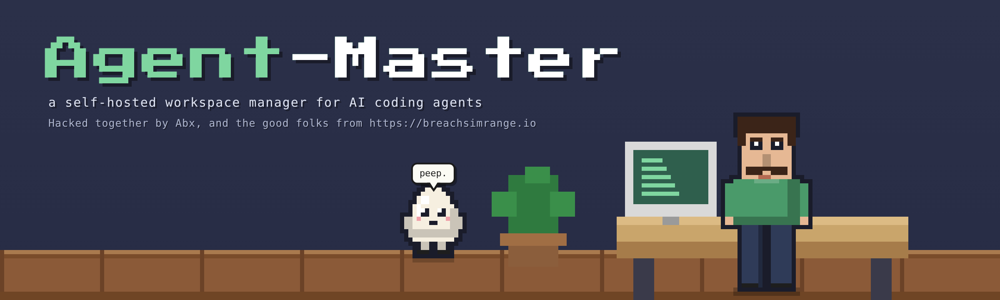
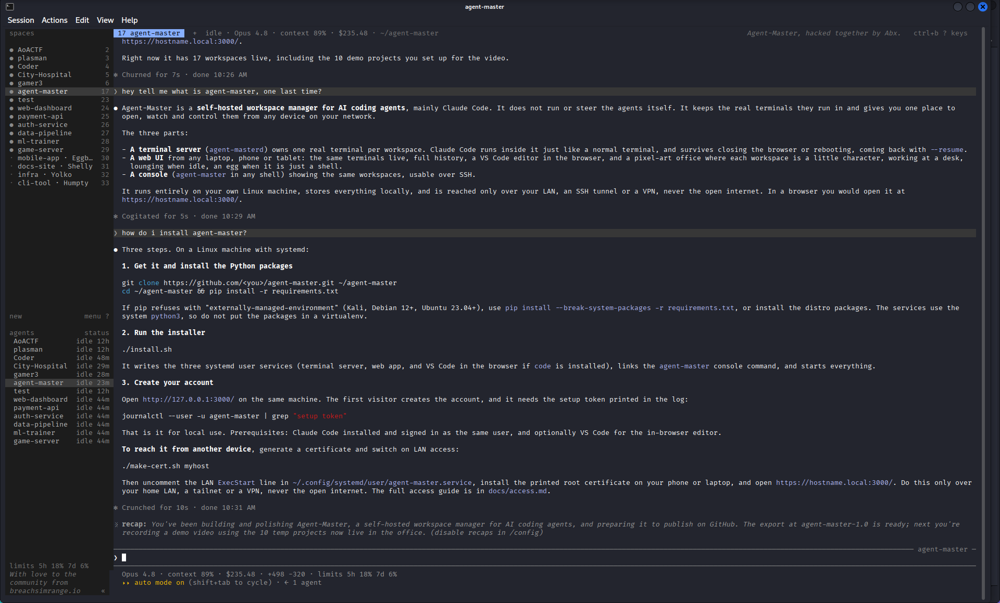
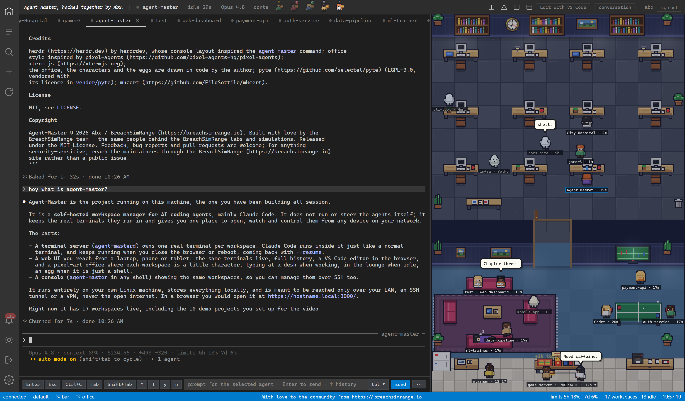
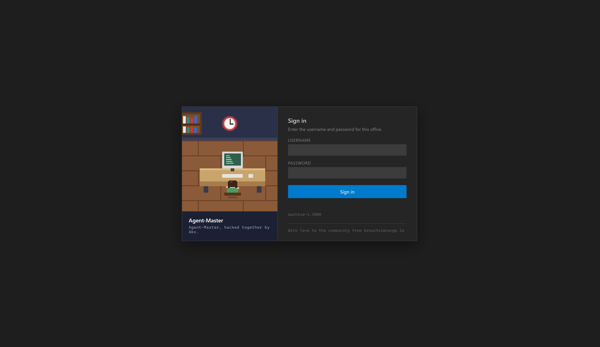
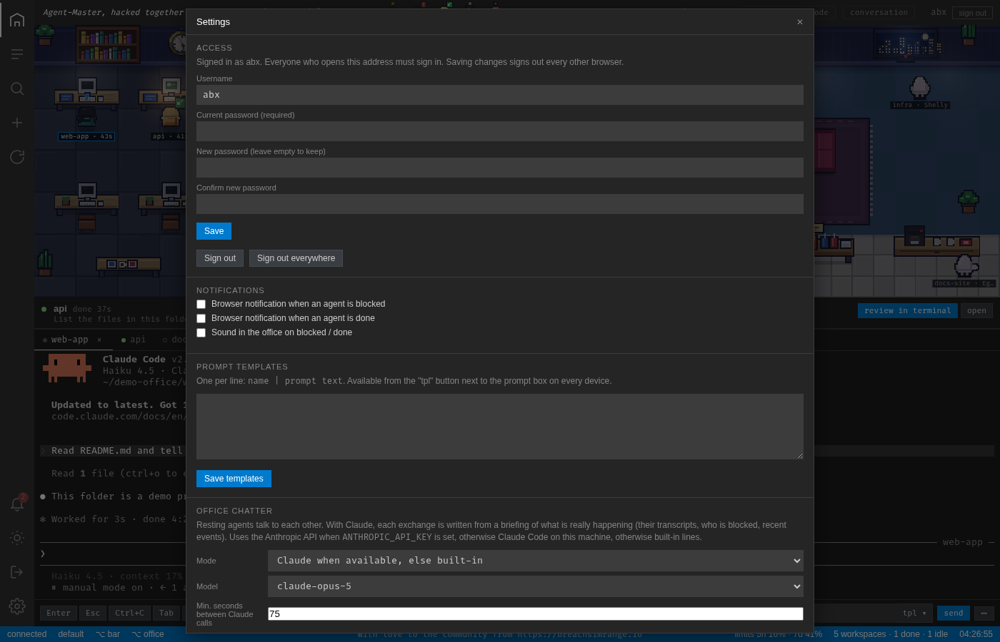
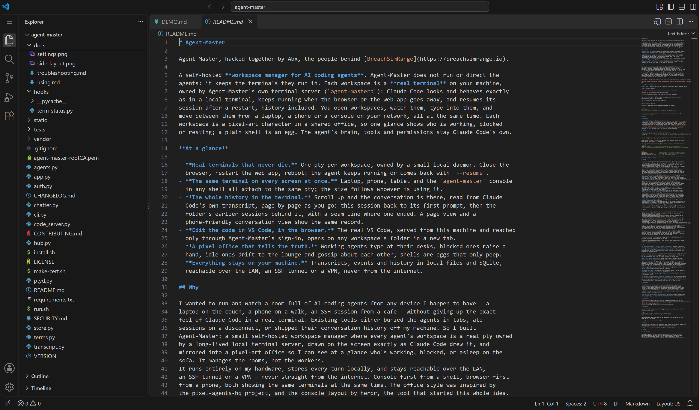
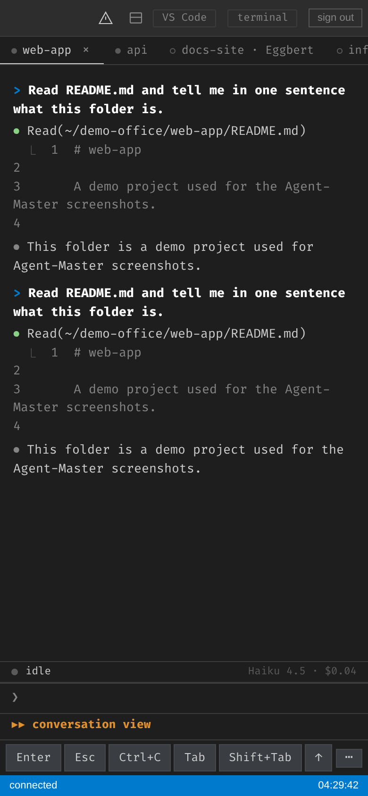

<p align="center">
  
</p>

# Agent-Master

Agent-Master is a self-hosted **workspace manager for AI coding agents**. Agent-Master does not run or direct the
agents: it keeps the terminals they run in. Each workspace is a **real terminal** on your machine,
owned by Agent-Master's own terminal server (`agent-masterd`).

Claude Code looks and behaves exactly as in a local terminal, keeps running when the browser or the web app goes away, and resumes its session after a restart, history included. You open workspaces, watch them, type into them, and move between them from a laptop, a phone or a console on your network, all at the same time. 

Each workspace is a pixel-art character in a shared office, so one glance shows who is working, blocked
or resting; a plain shell is an egg. The agent's brain, tools and permissions stay Claude Code's own.

Agent-Master, hacked together by Abx ([Abhijith B R](https://www.linkedin.com/in/abhijith-b-r/)), the people
behind [BreachSimRange](https://breachsimrange.io).

**At a glance**

**Real terminals that never die:** One pty per workspace, owned by a small local daemon. Close the
  browser, restart the web app, reboot: the agent keeps running or comes back with `--resume`.
**The same terminal on every screen at once:** Laptop, phone, tablet and the `agent-master` console
  in any shell all attach to the same pty; the size follows whoever is using it.
**The whole history in the terminal:** Scroll up and the conversation is there, read from Claude
  Code's own transcript, page by page as you go: this session back to its first prompt, then the
  folder's earlier sessions behind it, with a seam line where one ended. A page view and a
  phone-friendly conversation view show the same record.
**Edit the code in VS Code, in the browser:** The real VS Code, served from this machine and reached
  only through Agent-Master's sign-in, opens on any workspace's folder in a new tab.
**A pixel office for fun and quick overview:** Working agents type at their desks, blocked ones raise a
  hand, idle ones drift to the lounge and gossip about each other; shells are eggs that only peep.
**Everything stays on your machine:** Transcripts, events and history in local files and SQLite,
  reachable over the LAN, an SSH tunnel or a VPN, never from the internet.

## Why

I have always wanted a simple way to get to all my vibe coding projects and workspaces from wherever I am, whether that's my laptop on the recliner, my phone, or from a cafe without giving up the exact
feel of Claude Code in a real terminal.  Open it up, edit things remotely, and pick up right where I left off.

Not a boring terminal stitched together with a few access methods that still gives you limited control and limited visibility. I have used Herdr and a few similar tools, and I really liked them, but they either buried agents in tabs, lost sessions when the connection dropped, or sent my conversation history off my machine. I wanted something simple, secure, and a little more fun to look at.

So Agent-Master was born. I know, it is a lame name, but it is what it is.

It is a small self-hosted workspace manager. Every agent runs in a real terminal session that stays alive on my machine, shows up exactly the way Claude Code terminal, and also lives in a little pixel-art office, so I can see at a glance who is working, who is stuck, and who is asleep on the sofa.

Agent-Master manages the workspaces, not the workers. Dont let the name confuse you!

It runs entirely on my hardware, stores every turn locally, and stays reachable over the LAN,
an SSH tunnel or a VPN - never straight from the internet. Console first from a shell, browser from a phone, both showing the same terminals at the same time. 

I have added a few methods for accessing the Web UI securely, for local network (Both safe and unsafe) or Internet.

The office style was inspired by
the pixel-agents-hq project, and the console layout by herdr, the tool that started this whole idea.
Have fun with Agent-Master and let us know what you think.

With love, Abx


<summary>More screenshots</summary>

**Console view**



**Here is the Web UI**



**Sign-in page** - one account per office; the first visitor creates it with the setup token from the log.



**Settings** - access, notifications, prompt templates, office chatter, appearance.



**VS Code** - Edit workspaces using VS Code via browser.



**On a phone** - the office at the top, the live terminal below, quick keys under the input.
Works over the SSH tunnel or a VPN the same way.




## Requirements

- **Linux with systemd** and **Python 3.11 or newer**. macOS and Windows are not supported: the terminal
  server relies on Linux ptys and systemd user services.
- **Claude Code** installed and signed in for the same user (`claude` on the `PATH` or in `~/.local/bin`).
  The agents use its login, settings and hooks, and the UI reads its transcripts in `~/.claude/projects/`.
- `pip install -r requirements.txt` (fastapi, uvicorn, httpx, websockets). Optional `anthropic` for
  API-backed lounge chatter. The console's terminal emulator (pyte) is vendored. The services run under
  the **system** `python3`, so install the packages there, not in a virtualenv (or point the unit files
  at your venv's python). On Kali, Debian 12+ or Ubuntu 23.04+ `pip` refuses to touch the system
  environment (PEP 668); use `pip install --break-system-packages -r requirements.txt`, or the distro
  packages (`sudo apt install python3-fastapi python3-uvicorn python3-httpx python3-websockets`).
- Optional: **VS Code** installed (`code` on the `PATH`) for editing in the browser.

## Quickstart

**Prerequisites:** Linux with systemd, Python 3.11+, and Claude Code installed (see
[Requirements](#requirements)). Do every step below as your **normal user - never with `sudo`**.
Agent-Master runs as you, under your home directory.

**1. Get the code and install the dependencies.**

```sh
git clone https://github.com/BreachSimRange/Agent-Master.git ~/agent-master
cd ~/agent-master
pip install -r requirements.txt            # if pip refuses (PEP 668 on Kali/Debian 12+/Ubuntu 23.04+): add --break-system-packages
```

**2. Sign in to Claude Code** (once). Agent-Master does not manage this login; each agent runs the real
`claude` binary and inherits its account. Install Claude Code first if you have not
([Anthropic's docs](https://docs.anthropic.com/en/docs/claude-code)), then:

```sh
claude                                     # the first run walks you through sign-in (Claude Pro/Max or an Anthropic Console account)
```

Credentials are saved in `~/.claude/` and every workspace reuses them (or set `ANTHROPIC_API_KEY`).

**3. Install and start Agent-Master.**

```sh
./install.sh
```

This writes and starts two systemd **user** services in the right order - the terminal server
(`agent-masterd`) first, then the web app (`agent-master`) - links the `agent-master` console command
into `~/.local/bin/`, and enables linger so both survive a reboot. Manage them afterwards with
`systemctl --user status|restart|stop agent-master agent-masterd` (details in [Run and configure](docs/run.md)).

**4. Open it and create the account.** Open `http://127.0.0.1:3000/` on the same machine. The first
visitor creates the account using the setup token printed in the log:

```sh
journalctl --user -u agent-master | grep 'setup token'
```

That is the whole install. The two sections below are optional.

### Optional: edit workspaces in VS Code (in the browser)

Agent-Master can serve the *real* VS Code in a browser tab. Install VS Code so the `code` command is on
your `PATH`, then re-run `./install.sh` - it adds a third service (`agent-master-code`) when it finds `code`.

```sh
# Debian / Kali / Ubuntu (official Microsoft repo); or download from https://code.visualstudio.com
sudo apt-get install -y wget gpg
sudo mkdir -p /etc/apt/keyrings
wget -qO- https://packages.microsoft.com/keys/microsoft.asc | gpg --dearmor | sudo tee /etc/apt/keyrings/packages.microsoft.gpg >/dev/null
echo "deb [arch=amd64,arm64,armhf signed-by=/etc/apt/keyrings/packages.microsoft.gpg] https://packages.microsoft.com/repos/code stable main" | sudo tee /etc/apt/sources.list.d/vscode.list >/dev/null
sudo apt-get update && sudo apt-get install -y code
cd ~/agent-master && ./install.sh          # now adds the VS Code service (use --no-code to skip it)
```

### Alternative: run by hand, without installing anything

Just want a quick look without systemd? Skip `install.sh` and run the two processes yourself in two
shells. Nothing is installed, nothing survives a reboot, and `systemctl` does not manage them.

```sh
python3 ptyd.py              # shell 1: the terminal server (agent-masterd); leave it running
./run.sh                     # shell 2: the web app on http://127.0.0.1:3000/
```

`run.sh` starts **only** the web app, so the terminal server must already be running or the UI shows
"terminal server offline".

From another device, use one of the three supported paths in [Access the UI safely](docs/access.md);
HTTPS on your own hostname over the home LAN, a tailnet or a VPN is the usual one:

```sh
./make-cert.sh myhost        # once: a certificate and a root CA to install on every device
# then in ~/.config/systemd/user/agent-master.service, the LAN ExecStart line that install.sh left commented
```

Console basics:

```sh
agent-master                          # the console: sidebar + live terminal, Ctrl+B keys, q detaches
agent-master new ~/project            # start Claude Code in a folder (--shell, --model, --resume ID)
agent-master send NAME "run tests"    # type a prompt without opening the console
```

Everything else, options, reboot behaviour, files: [Run and configure](docs/run.md). The UI action by
action: [Using it](docs/using.md).

## Features

- **Agent's Office**: one character per workspace. Working and blocked agents type at their desk, done ones
  sit back, idle ones linger at their desk for five minutes and then rotate through the lounge:
  coffee, burgers, table tennis, a nap, the TV, a book on the sofa, small talk. Comic balloons on
  every status change, agents that walk over when they touch each other's files, lounge conversations
  written by Claude from what the agents are really doing, a whiteboard with the current tasks,
  nameplates on desks, a clock and day-night lighting from the real time.
- **Card**: click a character for agent kind and version, model and effort, status, task or question,
  folder and branch, session id, prompts, tool calls, token usage and time per status.
- **Real terminals** (the default): every workspace is a pseudo-terminal owned by `agent-masterd`,
  running Claude Code, another agent (codex, gemini, any command) or a plain shell. The browser gets
  the raw terminal bytes and draws them with xterm.js, so the screen is exactly Claude Code's own:
  the `❯` prompt, the mode line, Shift+Tab to cycle modes, Esc, permission prompts, everything.
  Keystroke to echo is a few milliseconds on the LAN. Up to three terminals side by side, quick keys,
  an optional prompt box with history, templates and broadcast, screenshot paste, and an attention
  panel for blocked questions and done tasks.
- **Edit the files in VS Code, in the browser**: the "Edit with VS Code" button in the ribbon (or the same button on
  the character card) opens the workspace's folder in the real VS Code, served from this machine by
  `code serve-web` and reached only through Agent-Master's sign-in, host rules and TLS. It opens in a new
  tab. Optional: it needs VS Code installed and the `agent-master-code` service (see Run).
- **A shell on the machine**: the `>_` button next to the tabs (or "New terminal" in Ctrl+K) opens
  your login shell in the home folder, right in the browser. In the office a shell is an egg named after
  its folder plus an egg name ("home · Eggbert"): no agent inside, so it only peeps, rolls around both rooms, and the agents tease it.
- **Console for the terminal**: `agent-master` in any shell on the machine (locally or over SSH)
  opens a console: workspaces in a sidebar, the live terminal next to it, Ctrl+B keys.
  Detach and everything keeps running; the web UI and the console show the same terminals.
- **Never lose a session**: the terminal server is its own service, so closing the browser or
  restarting the web app does not touch a running agent. Reopen the page and the screen is replayed.
  Each Claude Code terminal is started with a known session id; after a restart of the terminal
  server or a reboot it is started again with `--resume <id>` and the conversation is back.
- **Per-agent chat history in the local DB**: every prompt, tool call and reply is stored in
  `~/.config/agent-master/events.db` (`agent_history` / `agent_events` tables), imported from
  Claude Code's transcript the first time an agent is adopted and appended live from there on.
  Scroll up in the terminal or open "history" from the character card for the full record with
  timestamps and tool results - nothing leaves the machine.
- **Same terminals from any device, at the same time**: browsers on your laptop, phone or tablet
  and the `agent-master` console all attach to the same pty concurrently. The screen is replayed
  on connect and the size follows whoever typed or resized last, so you can hand a task off from
  the desk to the couch without ending anything.
- **Claude Code's own stats**: every Claude terminal reports Claude Code's status snapshot. The
  web UI and the console show each agent's session name, model, context used, cost, lines changed,
  prompt cache and Claude Code version, and your 5-hour and 7-day usage limits. When a newer Claude
  Code is installed than an agent runs, it says "update ready" with a one-click restart. The same
  numbers appear on a line under each agent's input box, and each agent's session is named after
  its workspace.
- **Status without screen scraping**: Claude Code hooks tell the terminal server when an agent is
  working, blocked on a permission, or done, and what the last prompt was. The office, balloons,
  attention panel and cards follow those events.
- **Headless agents (optional)**: Claude Code driven through its JSON interface with no terminal, for
  unattended jobs. Tick "Headless" in the new-workspace dialog. A headless agent can be moved into a
  real terminal from its card ("move to terminal") with the same session.
- **Shell**: VS Code look, office on top or on the right, focus mode, Ctrl+K palette, event log with
  time per status, notifications, light theme, phone layout, drag and drop of characters (mouse or touch).
- **Access**: username and password, signed cookies, lockout, origin checks, CSP. Three safe ways in,
  described under [Access the UI safely](docs/access.md): your own LAN over HTTPS with a
  `.local` hostname, an SSH tunnel, or a VPN. Never straight from the internet or an untrusted network.

## Security

- The first visitor creates the account (10+ character password) and always needs the setup token
  printed in the log (`journalctl --user -u agent-master`): a proxy on the machine would make every
  visitor look local, so the client address is never trusted for that step. Sessions are HMAC-signed
  HttpOnly SameSite cookies (Secure with TLS or `--behind-proxy`), 30 days, invalidated by a
  credential change or "sign out everywhere".
- Failed sign-ins are delayed and serialised; 8 failures lock the address for 15 minutes, and 40
  failures from all addresses together pause sign-in for everyone for 15 minutes.
- Behind a proxy on this machine (Caddy, nginx, `tailscale serve`), run with `--behind-proxy` so the
  lockout and the logs see the real client address instead of 127.0.0.1 for everyone. VS Code is
  reached only through the app's own proxy under `/code/`, with a connection token as a second lock.
- Every state-changing request and the websocket must come from the page's own origin. Strict CSP
  (scripts only from this server), `X-Frame-Options: DENY`, `nosniff`, no-referrer, HSTS with TLS.
  Bodies capped at 1 MB (12 MB for screenshot uploads, checked for image magic bytes).
- The folder browser, session list, workspace creation and the folder VS Code is asked to open stay inside `$HOME`
  (a signed-in operator has a shell anyway; the rule keeps the address bar from being a shortcut). `~/.config/agent-master/`
  is mode 700, files 600; the terminal server has no TCP port, only an owner-only Unix socket.

> [!CAUTION]
> **Never expose Agent-Master directly to the internet.** A signed-in operator has a shell, an editor
> and every agent on the machine, so the account password would be the only thing between the
> internet and your computer. No router port forwarding, no public reverse proxy, no Tailscale Funnel
> or Cloudflare Tunnel, no `--host 0.0.0.0` on a machine with a public address.

> [!TIP]
> **Recommended: a private network you control, plus the root certificate on every device.** Put the
> machine and your devices on a tailnet (Tailscale) or your own WireGuard VPN, serve HTTPS with the
> certificate from `make-cert.sh`, and install its root certificate on each phone, tablet and laptop
> that will use the UI. Then only your devices can reach the port at all, every connection is
> encrypted end to end, and a device without the root certificate cannot be tricked by a look-alike
> server. The SSH tunnel is the equally safe choice for a single laptop.

> [!WARNING]
> **Do not use it over public or untrusted Wi-Fi without that root certificate.** On a hotel, cafe,
> airport or office network, a plain `--host 0.0.0.0` instance or a browser that clicked through a
> certificate warning can be intercepted. With the VPN or tunnel up and the root certificate
> installed, an untrusted network underneath does not matter.

The sign-in, lockout and origin checks are a second lock, not a reason to open the door. There are
exactly three supported ways in.

The three supported ways in, with commands: [Access the UI safely](docs/access.md).

## FAQ

**It gives a signed-in browser a shell on my machine. Is that safe?** It is exactly as safe as the
network you put in front of it and the password you chose, and no safer. A signed-in operator can type
into every agent, open a shell and edit files as your user, which is the point of the tool. So the
sign-in is a second lock, not the door: keep the port on your LAN, a tailnet, a VPN or an SSH tunnel,
never on the internet, and install the root certificate on the devices you use. The Security section
lists what the app does on its side: signed sessions, lockouts, origin checks, strict headers, and a
setup token that is always required.

**Why not code-server, tmux, or herdr?** tmux keeps sessions but has no idea what an agent is, no phone
view, no history and no office. code-server is an editor, not a place to run and watch agents; here it
is optional, behind the same sign-in, one button away. herdr is the console this project's console
imitates, and it started the idea: Agent-Master is the browser-first, Claude-Code-aware version of
that idea, with the pixel office on top, and it needs nothing but its own small daemon.

**Does it run on macOS or Windows?** No. The terminal server is built on Linux ptys and runs as a
systemd user service, and the console assumes a Linux terminal. A Linux box or VM at home, reached
from a Mac, a phone or anything else with a browser, is the intended setup.

**Where do my conversations go?** Nowhere. The history you scroll through is read from Claude Code's
own transcript files under `~/.claude/projects/` on this machine, and events, status times and
preferences live in a local SQLite file. Nothing is copied off the machine by Agent-Master. Claude Code
itself talks to Anthropic as it always does; the optional lounge chatter can use the Anthropic API if
you give it a key, and VS Code in the browser fetches extensions from Microsoft's marketplace.

**What happens when the machine reboots?** The terminal server comes back with the user services and
starts every Claude Code again with `--resume` on its session id, so each workspace opens where it
left off, history included. Plain shells come back as fresh shells.

**Can several people use it?** One account per office. Everyone who signs in is the same operator with
the same power, so share it only with people you would give a shell to.

**Why the eggs?** A workspace that is only a shell has no agent inside. The office draws it as an egg,
and the agents tease it. It is also the quickest way to see at a glance which workspaces are running
an agent and which are not.

**An agent still asks before some shell commands even in auto mode. Why?** Auto mode (Shift+Tab) accepts
file edits automatically but still prompts for shell commands it considers risky, and the allow-list is
per folder, so it differs between workspaces. Approve a command once with "don't ask again" to whitelist
it there. To let a workspace run every command with no prompt, start it with the "run all commands
without asking (bypass)" option in the new-workspace dialog, or right-click a running workspace and pick
it; that restarts the agent in bypass-permissions mode. Use it only in a folder you trust.

## Known issues

- **Opening the web UI on a workspace that a console is using resizes it to the browser.** A
  terminal follows whoever types in it, and opening a browser tab is meant to change nothing. But
  when the page opens a workspace it replays the terminal's recent output, which includes the
  control sequences Claude Code sent at start-up: focus reporting and a few queries about the
  terminal. A browser terminal answers those queries automatically and reports focus when the page
  focuses it, and the daemon cannot yet tell those automatic replies from keystrokes, so it treats
  the browser as the one typing and hands it the size. The console then shows a margin. The same
  happens on a later click into the browser terminal. Typing in the console takes the size back at
  once. The fix is to count input as typing only when something is left after stripping the
  automatic reports (focus, mouse, cursor position, device attributes, keyboard protocol and colour
  answers); it lives in one place in `ptyd.py`.

- **VS Code and an agent can save the same file within the same second.** They edit the same files on
  disk. VS Code reloads a file that changed underneath it and Claude Code re-reads a file before it
  edits, so day to day this is fine, but two saves inside a second can lose one of them, as with
  desktop VS Code next to a terminal. Let the agent finish a turn before you save its file.

## Documentation

- [Run and configure](docs/run.md): every option, the systemd services, reboots, files and data.
- [Access the UI safely](docs/access.md): home LAN with HTTPS, SSH tunnel, tailnet or VPN, and why not the internet.
- [Using it](docs/using.md): the web UI and the console, action by action.
- [How it works](docs/internals.md): the parts and the protocols between them.
- [Troubleshooting](docs/troubleshooting.md).

## Contributing

Issues and pull requests are welcome. Keep it plain: Python with FastAPI only, vanilla JavaScript
without a build step, vendored libraries, art drawn in code. Run `node --check` on the JavaScript and
`python3 -m py_compile` on the Python before a PR. Test against a second terminal server, never
against your running agents:

```sh
python3 ptyd.py --config-dir /tmp/amtest --socket /tmp/amtest.sock &
AGENT_MASTER_PTYD_SOCK=/tmp/amtest.sock ./cli.py new ~ --shell --no-attach
AGENT_MASTER_PTYD_SOCK=/tmp/amtest.sock python3 app.py --port 3019 --no-auth --config /tmp/amtest/config.json
```

The separate terminal server socket keeps your real terminals out of the test instance, so a test
cannot type into a real session.

**Security reports:** not as public issues, please - contact the maintainers through the
[BreachSimRange](https://breachsimrange.io) site.

## Credits

[herdr](https://herdr.dev) by herdrdev, whose console layout inspired the `agent-master` command; office
style inspired by [pixel-agents](https://github.com/pixel-agents-hq/pixel-agents);
[xterm.js](https://xtermjs.org);
the office, the characters and the eggs are drawn in code by the author; [pyte](https://github.com/selectel/pyte) (LGPL-3.0, vendored with
its licence in `vendor/pyte`); [mkcert](https://github.com/FiloSottile/mkcert).

## License

MIT, see `LICENSE`.

## Copyright

Agent-Master 2026 fromAbx ([Abhijith B R](https://breachsimrange.io/about)) /
[BreachSimRange](https://breachsimrange.io). Built with love by the
BreachSimRange team. Released under the MIT License. Feedback, bug reports and pull requests are welcome; for anything
security-sensitive, reach the maintainers through the [BreachSimRange](https://breachsimrange.io)
site rather than a public issue.
